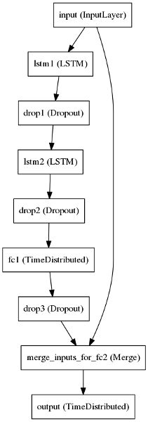

#LSTM with residual connection
A model to generate sanskrit text and learn reprenstations of sankrit aksharas. 

Residual connection[[1]](#resnet) will aid in learning simple mappings, whereas LSTM[[2]](#lstm) cells learn complex relationships.

*Note: The model was trained using Chapter-7 of Mahabharata on Nvidia GeForce GT 730.*

###Requirements:
* Thenao
* Keras

###Usage:
`python reslstm.py`
#####Pretrained weights:
* Remove layers weight intializations.
* Uncomment line 139 and add the weights.
* Fine-tuning: load weights and add *trainable = False* for layers which doesn't require fine-tuning.

####Citations:
<a id="resnet">
[1]He, K., Zhang, X., Ren, S., & Sun, J. (2016). Identity mappings in deep residual networks. arXiv preprint arXiv:1603.05027.

<a id="lstm">
[2]Graves, A., & Schmidhuber, J. (2005). Framewise phoneme classification with bidirectional LSTM and other neural network architectures. Neural Networks, 18(5), 602-610.

